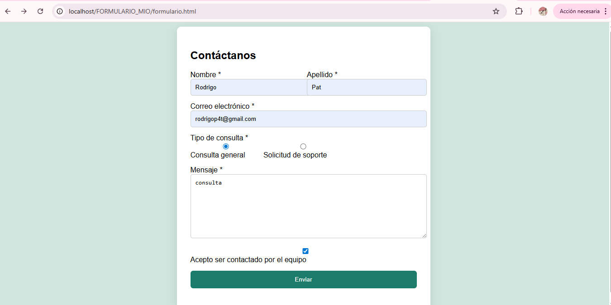

Formulario de Contacto - Examen Diagnóstico 

## Tabla de contenidos
- [Resumen](#resumen)
  - [Captura de pantalla](#captura-de-pantalla)
  - [Enlaces](#enlaces)
- [Mi proceso](#mi-proceso)
  - [Tecnologías utilizadas](#tecnologías-utilizadas)
- [Instrucciones de Configuración](#instrucciones-de-configuración)
- [Autor](#autor)

## Resumen
Este proyecto consiste en un formulario de contacto funcional de extremo a extremo (Full Stack). He implementado el frontend siguiendo las mejores prácticas de accesibilidad y un backend sólido utilizando PHP para procesar los datos y almacenarlos en una base de datos MariaDB gestionada a través de Laragon y HeidiSQL.

### El desafío
- **Envío exitoso:** Los datos se capturan y se guardan correctamente en la base de datos.
- **Validación:** Uso de atributos HTML5 para asegurar que el correo sea válido y los campos obligatorios no se omitan.
- **Accesibilidad:** Uso de etiquetas `<label>` vinculadas a inputs y estados focus definidos.
- **Base de Datos:** Estructura creada en HeidiSQL con tipos de datos optimizados (VARCHAR, INT, TEXT).

### Captura de pantalla

*(Asegúrate de subir una foto de tu formulario con el nombre screenshot.png a GitHub)*

### Enlaces
- **URL en GITHUB:** [https://github.com/rodrigop4t-hash/Proyecto.git]
- **URL del site:** Ejecución local bajo el entorno Laragon (http://localhost/FORMULARIO_MIO/formulario.html)

## Mi proceso

### Tecnologías utilizadas
- **Frontend:** HTML5 semántico, CSS3 para el diseño responsivo.
- **Backend:** PHP para la lógica de procesamiento y recepción de variables `$_POST`.
- **Base de Datos:** MariaDB/MySQL.
- **Herramientas:** Laragon (Servidor local) y HeidiSQL (Gestor de BD).

## Instrucciones de Configuración
Para que el docente pueda ejecutar este proyecto localmente:
1.  **Descargar:** Clonar o descargar este repositorio en la carpeta `C:/laragon/www/`.
2.  **Base de Datos:** Abrir HeidiSQL, crear una base de datos llamada `contacto_db` (o el nombre que usaste) e importar el archivo `.sql` adjunto en este repositorio.
3.  **Servidor:** Iniciar Laragon y verificar que Apache y MySQL estén corriendo en los puertos 80 y 3306 respectivamente.
4.  **Acceso:** Abrir el navegador e ingresar a `localhost/nombre_de_tu_carpeta`.

## Autor
- **Nombre completo:** [ Julio Rodrigo Pat Balam]
- **N° Control:** [221k0025]
- **Grupo:** [8 - A]
- **Github:** [rodrigop4t-hash](https://github.com/rodrigop4t-hash/Proyecto.git)
